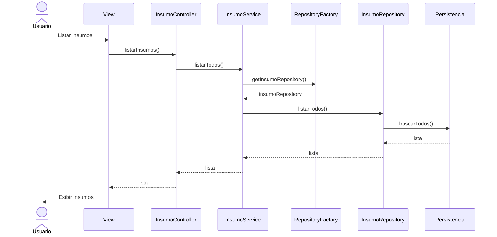
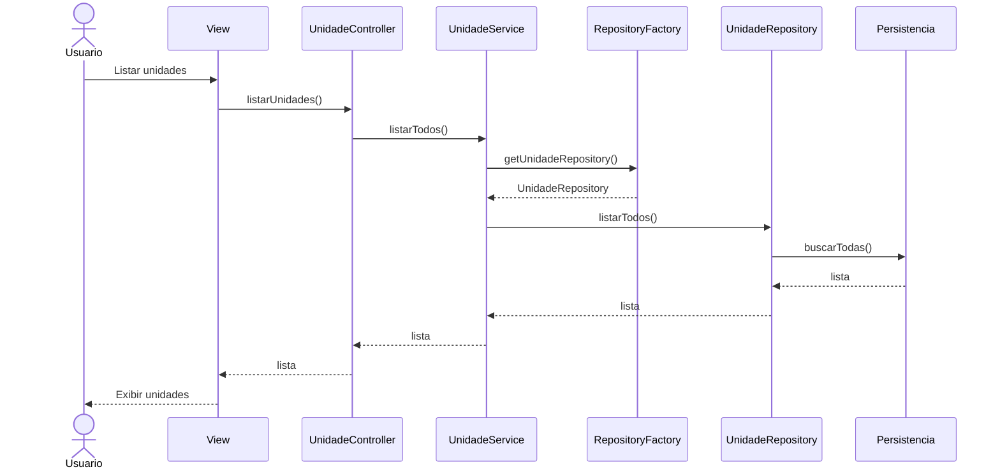
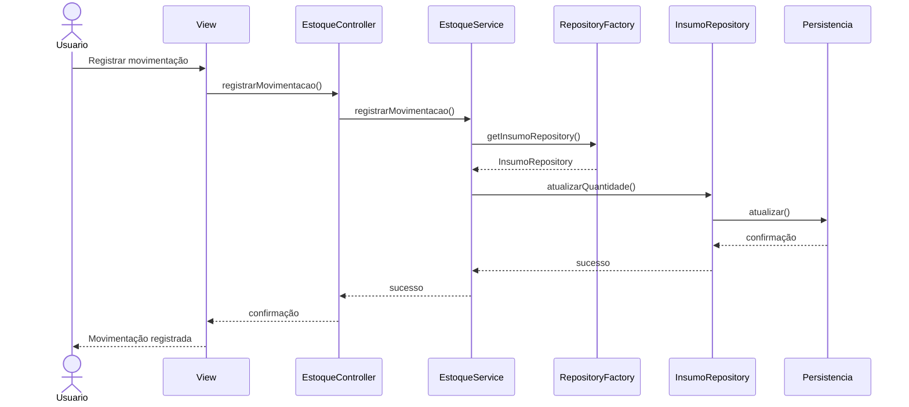
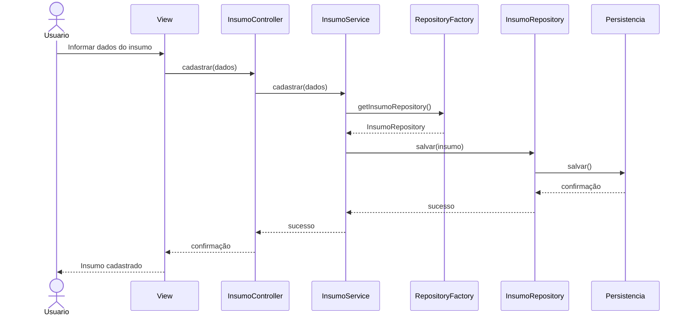
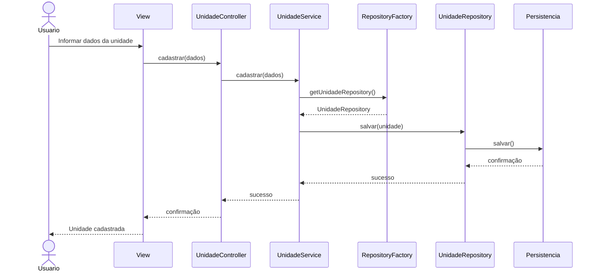

# Diagramas de Sequência — Sistema Redes de Padaria

## Listar Insumos

```mermaid
sequenceDiagram
actor Usuario
participant View
participant InsumoController
participant InsumoService
participant RepositoryFactory
participant InsumoRepository
participant Persistencia

Usuario->>View: Listar insumos
View->>InsumoController: listarInsumos()
InsumoController->>InsumoService: listarTodos()
InsumoService->>RepositoryFactory: getInsumoRepository()
RepositoryFactory-->>InsumoService: InsumoRepository
InsumoService->>InsumoRepository: listarTodos()
InsumoRepository->>Persistencia: buscarTodos()
Persistencia-->>InsumoRepository: lista
InsumoRepository-->>InsumoService: lista
InsumoService-->>InsumoController: lista
InsumoController-->>View: lista
View-->>Usuario: Exibir insumos
```

## Listar Unidades

```mermaid
sequenceDiagram
actor Usuario
participant View
participant UnidadeController
participant UnidadeService
participant RepositoryFactory
participant UnidadeRepository
participant Persistencia

Usuario->>View: Listar unidades
View->>UnidadeController: listarUnidades()
UnidadeController->>UnidadeService: listarTodos()
UnidadeService->>RepositoryFactory: getUnidadeRepository()
RepositoryFactory-->>UnidadeService: UnidadeRepository
UnidadeService->>UnidadeRepository: listarTodos()
UnidadeRepository->>Persistencia: buscarTodas()
Persistencia-->>UnidadeRepository: lista
UnidadeRepository-->>UnidadeService: lista
UnidadeService-->>UnidadeController: lista
UnidadeController-->>View: lista
View-->>Usuario: Exibir unidades
```

## Registrar Movimentação

```mermaid
sequenceDiagram
actor Usuario
participant View
participant EstoqueController
participant EstoqueService
participant RepositoryFactory
participant InsumoRepository
participant Persistencia

Usuario->>View: Registrar movimentação
View->>EstoqueController: registrarMovimentacao()
EstoqueController->>EstoqueService: registrarMovimentacao()
EstoqueService->>RepositoryFactory: getInsumoRepository()
RepositoryFactory-->>EstoqueService: InsumoRepository
EstoqueService->>InsumoRepository: atualizarQuantidade()
InsumoRepository->>Persistencia: atualizar()
Persistencia-->>InsumoRepository: confirmação
InsumoRepository-->>EstoqueService: sucesso
EstoqueService-->>EstoqueController: sucesso
EstoqueController-->>View: confirmação
View-->>Usuario: Movimentação registrada
```

## Cadastrar Insumo

```mermaid
sequenceDiagram
actor Usuario
participant View
participant InsumoController
participant InsumoService
participant RepositoryFactory
participant InsumoRepository
participant Persistencia

Usuario->>View: Informar dados do insumo
View->>InsumoController: cadastrar(dados)
InsumoController->>InsumoService: cadastrar(dados)
InsumoService->>RepositoryFactory: getInsumoRepository()
RepositoryFactory-->>InsumoService: InsumoRepository
InsumoService->>InsumoRepository: salvar(insumo)
InsumoRepository->>Persistencia: salvar()
Persistencia-->>InsumoRepository: confirmação
InsumoRepository-->>InsumoService: sucesso
InsumoService-->>InsumoController: sucesso
InsumoController-->>View: confirmação
View-->>Usuario: Insumo cadastrado
```

## Cadastrar Unidade

```mermaid
sequenceDiagram
actor Usuario
participant View
participant UnidadeController
participant UnidadeService
participant RepositoryFactory
participant UnidadeRepository
participant Persistencia

Usuario->>View: Informar dados da unidade
View->>UnidadeController: cadastrar(dados)
UnidadeController->>UnidadeService: cadastrar(dados)
UnidadeService->>RepositoryFactory: getUnidadeRepository()
RepositoryFactory-->>UnidadeService: UnidadeRepository
UnidadeService->>UnidadeRepository: salvar(unidade)
UnidadeRepository->>Persistencia: salvar()
Persistencia-->>UnidadeRepository: confirmação
UnidadeRepository-->>UnidadeService: sucesso
UnidadeService-->>UnidadeController: sucesso
UnidadeController-->>View: confirmação
View-->>Usuario: Unidade cadastrada
```
