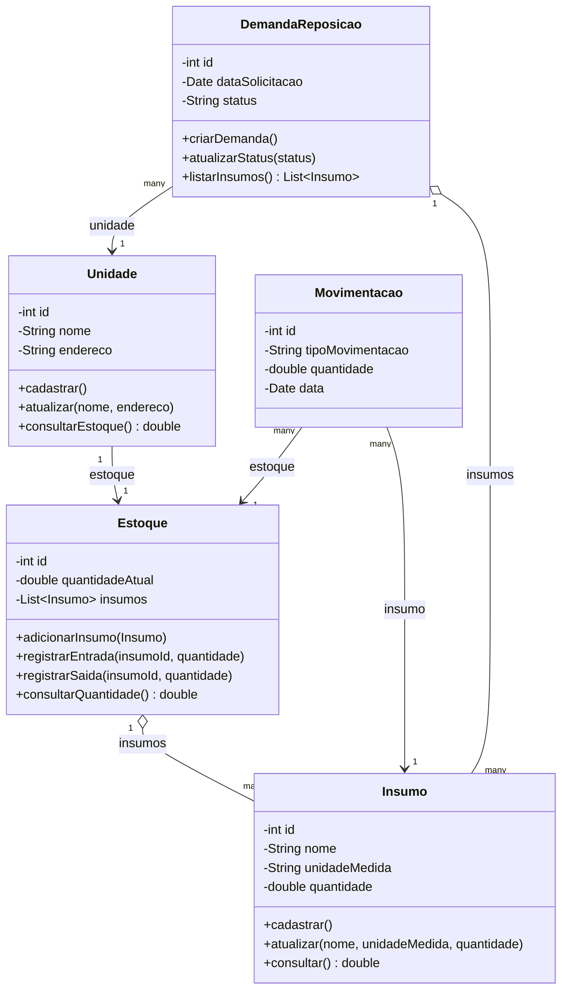
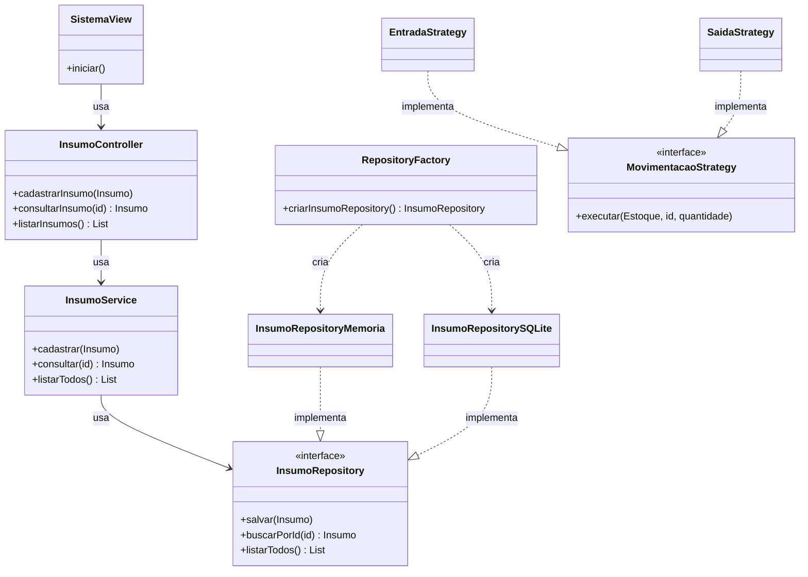

# Diagrama UML — Sistema Redes de Padaria

## Modelo de domínio

## Arquitetura em camadas (exemplo: Insumo)

> O mesmo padrão (Controller → Service → Repository) se repete para
> Estoque, Unidade, Movimentação e Demanda de Reposição.

